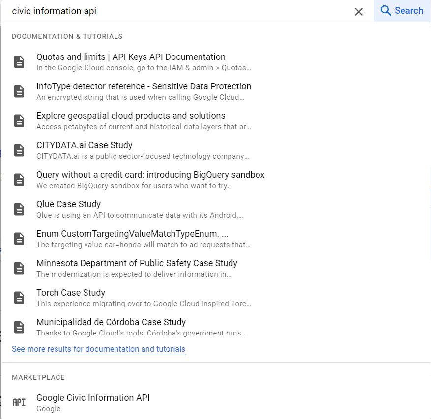
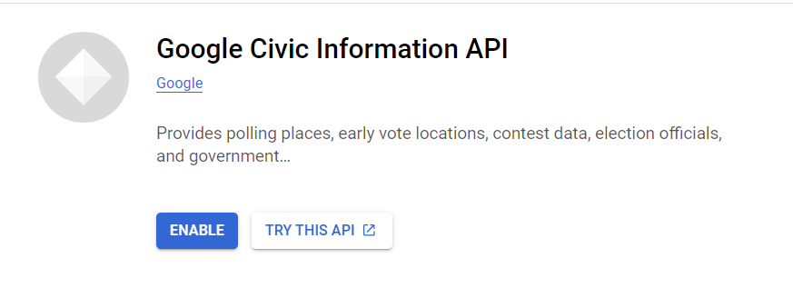
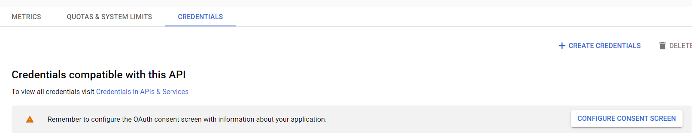
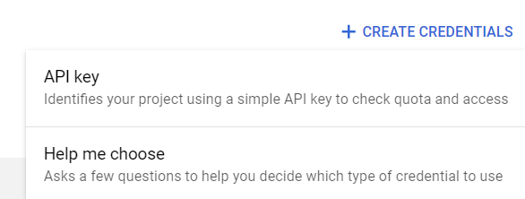
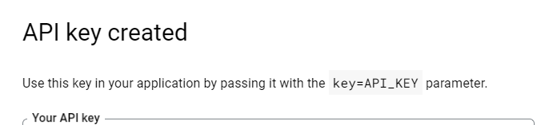

# polling_locations

## Project Structure
polling_locations/
├── data/
│ ├── Aggregated_github_data.csv
│ ├── master_school_address.csv
│ └── final_polling_locations.csv
├── images/
│ ├── civic_information_search.png
│ ├── enable_api.png
│ ├── credentials.png
│ ├── apikey.png
│ └── success.png
├── school_data/
│ ├── us-public-schools-az.csv
│ ├── us-public-schools-co.csv
│ └── ...
├── .env
├── example.env
├── polling.py
├── schooladdress.py
└── README.md

## Aggregated Data
- The Aggregated_github_data.csv file contains historical polling locations pulled from the following project, https://github.com/PublicI/us-polling-places , predominately 2020, however some states had 2018 data. This master csv was created by copy and pasting the data from the multiple CSVs, a script could have done this quicker, however I underestimated how long it would take at the beginning.


## States Not Included in the Data

The following states were not included in that data, and therefore this repository aims to explore how to collect this data for the following areas:

| State                  |
|------------------------|
| America Samoa          |
| Arizona                |
| Colorado               |
| District of Columbia   |
| Florida                |
| Guam                   |
| Hawaii                 |
| Idaho                  |
| Kansas                 |
| New York               |
| Oregon                 |
| Puerto Rico            |
| Tennessee              |
| Virgin Island          |
| Washington             |
| Wyoming                |

## Data Collection
- The data collection process is to first identify where polling locations are most likely to be, each state or territory may have a separate preference for where polling locations are. A good source that has all of the polling place locators in one place is https://www.vote.org/polling-place-locator/, however at this time this site is not updated for the upcoming election.

- The next step will be to look for open source datasets that will allow for addresses to be pulled in a manner that will allow for statewide coverage of polling locations.

- Usually states use schools as polling locations, so I used this to pull public school data, the only thing I am interested in is the address. I used this site: https://public.opendatasoft.com/explore/dataset/us-public-schools/export/?flg=en-us and api could be leveraged, but only needing a few places I just downloaded the CSVs. 

Created a Google Colab notebook to aggregate the address data from the school_data folder. Notebook can be found here: https://colab.research.google.com/drive/1RAgBTiXT-wcIj57Sjr2FDPgku_-GjTB6?usp=sharing 

Also, created a python script called schooladdress.py. One of data cleaning pieces you will find in the code is the value "BOX DOE" is removed, as this can not be used in the next phase I figured it was best to leave it out.

## Civic Information API
- I will be using the Google Civic Information API for this part of the project- https://developers.google.com/civic-information/docs/v2

- To obtain a Civic Information API key plenty of guides are out there to do it, high level overview:
  1. Create a google cloud console login (console.cloud.google.com).
  2. Search for the Civic Information API
    
    

  3. Enable API
    
    

  4. Now you need to create credentials, navigate and click "Create Credentials
    
    

  5. Now select API key
    
    

  5. You should see a screen saying API key created, make sure to save your key somewhere safe. 
    
    


- The API key is stored in a .env file, this is a good practice to keep your API keys out of your code. I have provided an example.env file simply rename to .env and paste in your api key.

## Make the Call

- We will be using the voterInfoQuery to pull polling locations using the school addresses we aggregated and are now in the master_school_address.csv located in the Data folder.

- The API call to the Google Civic Information API is pretty standard, Google allows the api key to be sent in the URL or as a parameter. I have chosen to send it within the url, however for sensitive information it is better to do it in parameter form. 

- The parameter that the API call is looking for is an address, so from our master_school_address.csv we had to do some formatting to ensure the address was in the format requested by Google. It is sent in the parameters as 'address'. How to send and receive requests is within the Google API documentation. 

- When the JSON is returned, we have to map it to columns that we are going to use for analysis (due to the timing of running the calls, I found that not all addresses returned polling locations. I believe that Google does not have the historical documentation, or this database is kept up to date for this election, and will be updated...it is important that for the most up to date polling information to search approximately 2 weeks before the election). 

- The results are then converted to a dataframe and saved as a csv and saved in the Data folder as final_polling_locations.csv

### How to use this project

#### Getting Started

#### Prerequisites
- Python 3.x installed
- Google Civic Information API key (see the "Civic Information API" section for instructions)

#### Setup
1. Fork the repository to your GitHub account.
2. Clone the forked repository to your local machine:
 git clone https://github.com/qepting91/polling_locations.git
3. Navigate to the project directory:
cd polling_locations
4. Create a virtual environment (optional but recommended):
python -m venv venv
5. Activate the virtual environment:
- For Windows:
  ```
  venv\Scripts\activate
  ```
- For macOS and Linux:
  ```
  source venv/bin/activate
  ```
6. Install the required dependencies:
pip install -r requirements.txt
7. Rename the `example.env` file to `.env` and replace `YOUR_API_KEY` with your actual Google Civic Information API key.

#### Usage
1. Run the `schooladdress.py` script to extract school addresses from the CSV files in the `school_data` folder:
python schooladdress.py
This script will generate the `data/master_school_address.csv` file.

2. Run the `polling.py` script to fetch polling locations using the Google Civic Information API:

python polling.py

This script will generate the `data/final_polling_locations.csv` file containing the polling location data.

3. The generated CSV files can be found in the `data` folder for further analysis and use.


