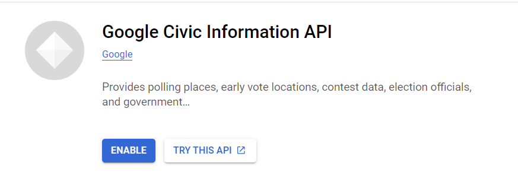
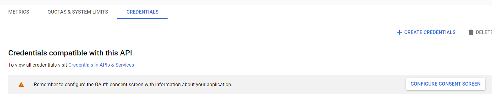
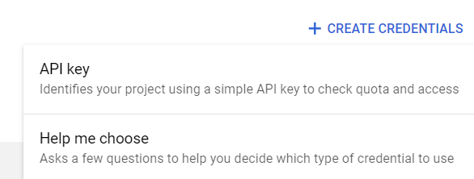
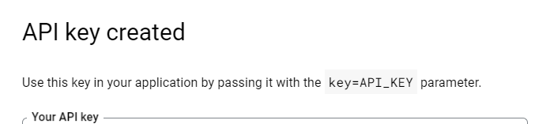

# polling_locations

## Aggregated Data
- The Aggregated_github_data.csv file contains historical polling locations pulled from the following project, https://github.com/PublicI/us-polling-places , predominately 2020, however some states had 2018 data. This master csv was created by copy and pasting the data from the multiple CSVs, a script could have done this quicker, however I underestimated how long it would take at the beginning.

The following states were not included in that data, and therefore this repository aims to explore how to collect this data for the following areas:
    - America Samoa
    - Arizona
    - Colorado
    - District of Columbia
    - Florida
    - Guam
    - Hawaii
    - Idaho
    - Kansas
    - New York
    - Oregon
    - Puerto Rico
    - Tennessee
    - Virgin Island
    - Washington
    - Wyoming

## Data Collection
- The data collection process is to first identify where polling locations are most likely to be, each state or territory may have a separate preference for where polling locations are. A good source that has all of the polling place locators in one place is https://www.vote.org/polling-place-locator/, however at this time this site is not updated for the upcoming election.

- The next step will be to look for open source datasets that will allow for addresses to be pulled in a manner that will allow for statewide coverage of polling locations.

- Usually states use schools as polling locations, so I used this to pull public school data, the only thing I am interested in is the address. I used this site: https://public.opendatasoft.com/explore/dataset/us-public-schools/export/?flg=en-us and api could be leveraged, but only needing a few places I just downloaded the CSVs. 

Created a Google Colab notebook to aggregate the address data from the school_data folder. Notebook can be found here: https://colab.research.google.com/drive/1RAgBTiXT-wcIj57Sjr2FDPgku_-GjTB6?usp=sharing 

Also, created a local python script called schooladdress.py. One of data cleaning pieces you will find in the code is the value "BOX DOE" is removed, as this can not be used in the next phase I figured it was best to leave it out.

## Civic Information API
- I will be using the Google Civic Information API for this part of the project- https://developers.google.com/civic-information/docs/v2

- To obtain a Civic Information API key plenty of guides are out there to do it, high level overview:
  1. Create a google cloud console login (console.cloud.google.com).
  2. Search for the Civic Information API
    
    

  3. Enable API
    
    

  4. Now you need to create credentials, navigate and click "Create Credentials
    
    

  5. Now select API key
    
    

  5. You should see a screen saying API key created, make sure to save your key somewhere safe. 
    
    

- Specifically we will be using the voterInfoQuery to pull polling locations using the school addresses we aggregated and are now in the master_school_address.csv.

